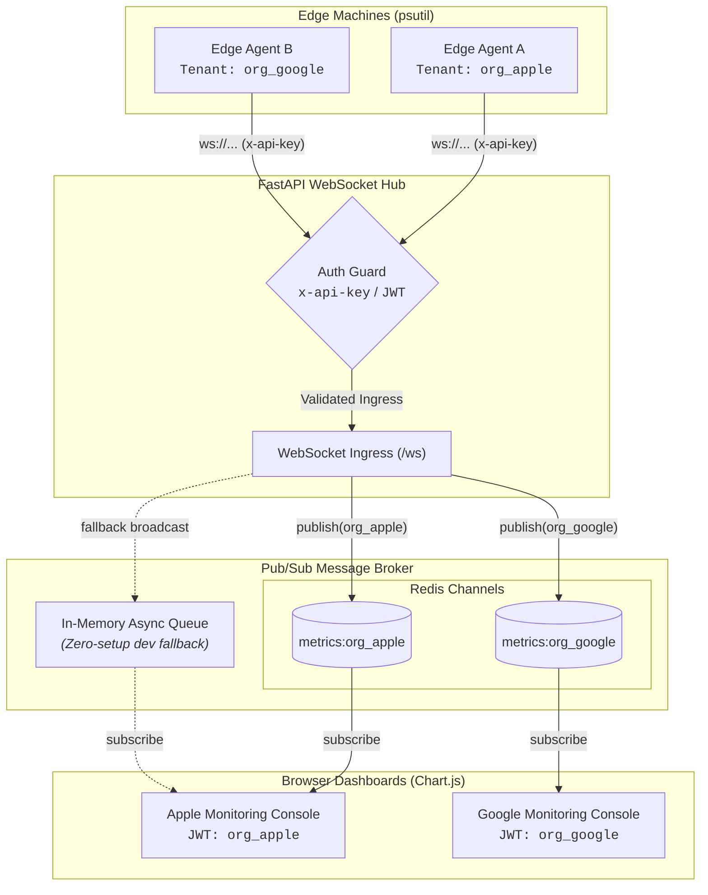

<div align="center">

# Pulse : Real-Time System Telemetry & Monitoring

[](https://www.python.org/)
[](https://fastapi.tiangolo.com/)
[](https://websockets.readthedocs.io/)
[](https://redis.io/)
[](https://www.docker.com/)
[](https://www.chartjs.org/)

**A lightweight, multi-tenant real-time hardware telemetry pipeline built over a weekend to implement my learning of websockets.**

</div>

---

## Overview

**Pulse** is an enterprise-grade, multi-tenant system monitoring tool. Edge machine agents capture hardware metrics (CPU, RAM, load) at high frequency and stream them through a **FastAPI WebSocket hub**. 

Data is dynamically routed through a **Redis Pub/Sub broker** into tenant-isolated channels (`metrics:<tenant_id>`) and pushed live to browser dashboards with zero-lag Chart.js visualization.

> **Zero-Setup Dev Mode:** Pulse includes an automatic in-memory broadcast fallback, so you can run and test everything locally with or without Docker/Redis.

---

## Architecture



---

## Key Features

- **Multi-Tenant Channel Routing:** Dynamically namespaces telemetry streams per organization (`metrics:org_apple`, `metrics:org_google`).
- **Dual Authentication Handshake:**
  - **Edge Agents:** Authenticated via `x-api-key` header.
  - **Browser Dashboards:** Authenticated via signed HMAC-SHA256 JWT tokens (`?token=...`).
  - **Policy Violation Rejection:** Automatically terminates unauthorized connections with WebSocket code `1008`.
- **Auto-Reconnecting Edge Daemon:** Edge client automatically reconnects with backoff if network drops or server restarts.
- **Ultra-Low Latency:** High-frequency (200ms / 5 Hz) sub-second telemetry streams.
- **Zero AI-Slop UI:** Clean, flat, distraction-free dashboard with solid contrast, no heavy gradients, and smooth rolling time-series buffers.

---

## Project Structure

```text
Pulse/
├── backend/
│   ├── broker.py          # Async Redis Pub/Sub manager + in-memory fallback
│   └── main.py            # FastAPI server, WebSocket hub, and static file host
├── agent/
│   └── client.py          # Edge hardware agent using psutil
├── frontend/
│   └── index.html         # Minimalistic real-time Chart.js dashboard
├── Dockerfile             # Container definition for Pulse Hub
├── docker-compose.yml     # Multi-container orchestration (Redis + Hub)
├── .env.example           # Template environment configuration
├── requirements.txt       # Python project dependencies
└── README.md              # Documentation
```

---

## Quickstart

### Option A: Run with Docker Compose (Recommended for Production/Redis)

Spin up both the **Redis Broker** and the **FastAPI Monitoring Hub** with one command:

```bash
docker compose up --build
```
The server will be available at `http://localhost:8000`.

Then start the local edge agent in your terminal:
```bash
python agent/client.py
```

---

### Option B: Run Locally with Python (Zero-Setup Dev Mode)

#### 1. Setup Environment
```bash
# Clone repository
git clone https://github.com/<your-username>/pulse-telemetry.git
cd pulse-telemetry

# Create virtual environment
python -m venv .venv
# On Windows:
.venv\Scripts\Activate.ps1
# On Linux/macOS:
source .venv/bin/activate

# Install dependencies
pip install -r requirements.txt
cp .env.example .env
```

#### 2. Start the Server
```bash
uvicorn backend.main:app --host 0.0.0.0 --port 8000 --reload
```

#### 3. Start the Telemetry Agent
In a second terminal:
```bash
python agent/client.py
```

#### 4. Open the Dashboard
Visit [http://localhost:8000](http://localhost:8000) in your browser. The dashboard connects via WebSockets and begins streaming live hardware stats.

---

## Configuration (`.env`)

| Variable | Default | Description |
|---|---|---|
| `PORT` | `8000` | Server listening port |
| `HOST` | `0.0.0.0` | Server listening host |
| `REDIS_URL` | `redis://localhost:6379` | Redis broker connection URI |
| `JWT_SECRET` | `pulse_enterprise_secret_key_2026` | Secret key used to sign browser JWTs |
| `PULSE_SERVER_URL` | `ws://localhost:8000/ws` | Hub WebSocket endpoint URL |
| `PULSE_API_KEY` | `sk_live_1234` | Edge agent authentication key |
| `PULSE_INTERVAL` | `0.2` | Telemetry polling frequency (seconds) |
| `PULSE_RECONNECT_DELAY` | `3.0` | Agent backoff delay on disconnect |

---

## Authentication Specs

1. **Edge Agent Connection:**
   - **Header:** `x-api-key: sk_live_1234`
   - **Assigned Tenant:** `org_apple`

2. **Browser Connection:**
   - **URL:** `ws://localhost:8000/ws?token=mock_jwt_here`
   - Alternatively, generate real signed JWTs via `/api/token?tenant_id=org_apple`.

---

## License

MIT License © 2026 Pulse Contributors. Built when bored over a weekend.
